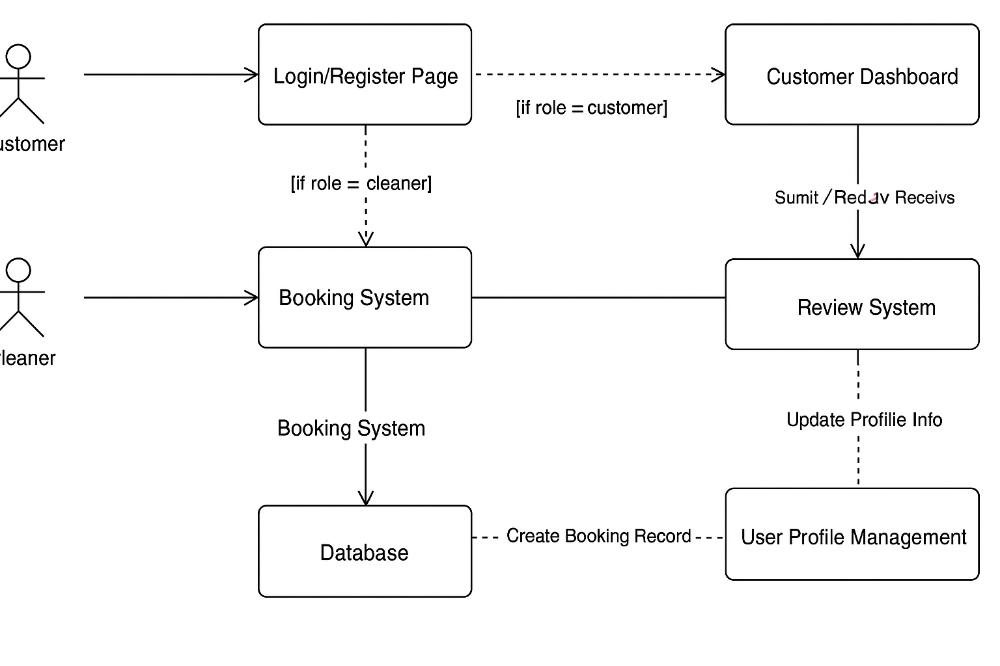

# CP3407 2025 - "MyClean" Solo Project

This repository is for my individual submission for the CP3407 Advanced Software Engineering project at James Cook University. The project is a cleaning service booking system called **MyClean**, which aims to provide a streamlined way for customers to book cleaning appointments and for service providers to manage their bookings.

---

## 👤 Developer

- **Name**: Johns Bijoy  
- **Project Type**: Individual  
- **Platform**: [Insert your deployment link here once available]  
- **GitHub Repo**: [Insert this repo's link]

---

## 🚀 Project Planning

### 🔹 User Stories / Initial Backlog  
- [User Stories](./User_stories.md)

### 🔹 Development Timeline  
Two solo iterations of 10 work days each:
- **Iteration 1**: Registration, Login, Booking System
- **Iteration 2**: Booking Management, Payment Simulation, Profile

---

## 🛠️ Iteration Logs

- [Iteration 1 Details](./iteration_1.md)  
- [Iteration 2 Details](./iteration_2.md)  
- [Future Iteration Ideas](./Iteration_Future.md)

---

## 🧱 System Design

### 🧭 Architecture Diagram  

### 🗃️ ER Diagram  

---

## 🧪 Testing & Validation

Testing details and screenshots are provided in iteration pages, including:
- Functional tests
- UI screenshots
- Manual walkthroughs

---

## 📂 Technologies & Tools

- **Platform**: [Bubble / PHP + MySQL / Other]
- **Version Control**: GitHub
- **Design Tools**: Figma, GenMyModel, Gliffy
- **Development**: HTML, CSS, JS (if applicable)
- **Project Management**: Trello

---

## 📌 Notes

- This is a solo implementation of the "MyClean" app for educational purposes.
- All features were planned and implemented independently.

