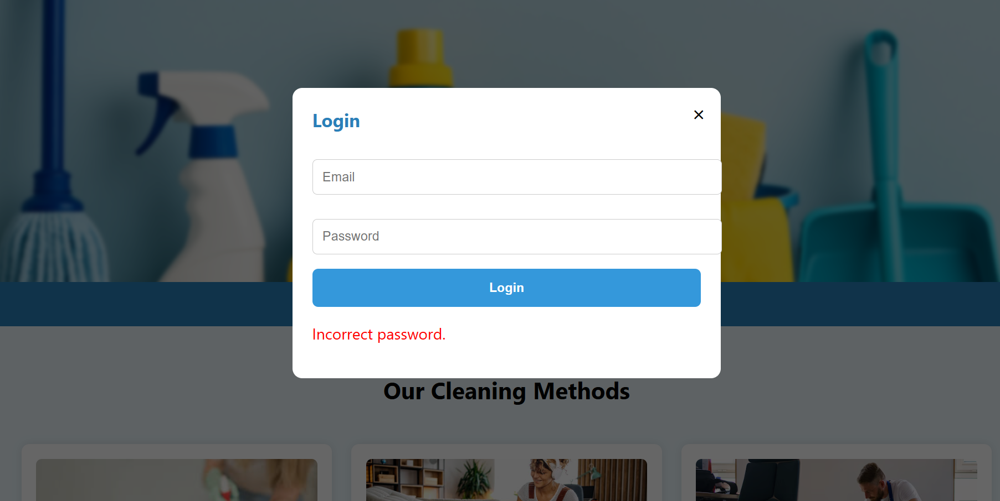
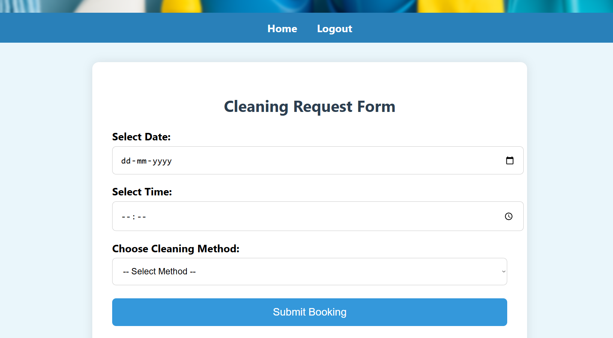
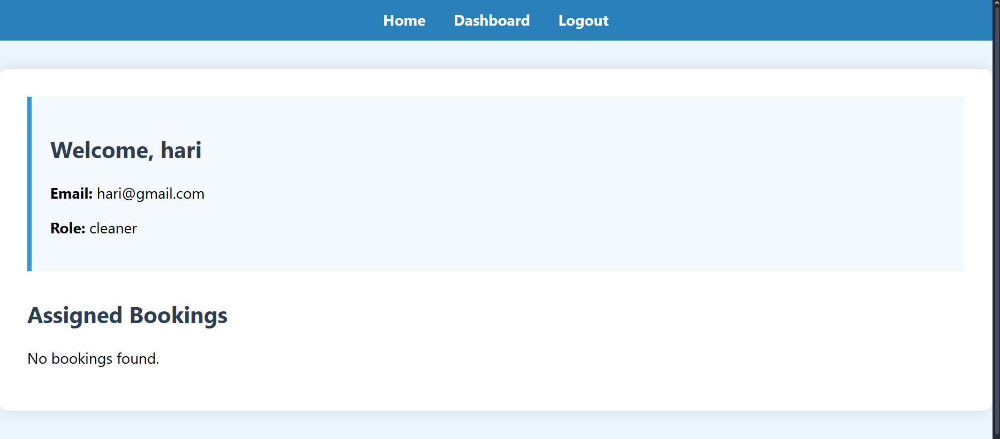

# Iteration 1 – Project Development Log

## Iteration Scope

This iteration focuses on building the core functionality of the MyClean application, including account access, basic booking features, and separate dashboards for customers and cleaners.

---

## Features Implemented

1. **User Registration and Login**  
   Enables account creation and secure login for both customers and service providers.

2. **Booking System**  
   Allows customers to book cleaning services by selecting a date and time.

3. **Role-Based Dashboard Access**  
   After login, users are directed to dashboards based on their role.

4. **Cleaner Booking Management**  
   Service providers can view assigned bookings on their dashboard.

---

## Key Activities

- Developed the login and registration UI
- Created database fields for users and bookings
- Built a functional booking form
- Implemented dashboard logic for different user roles
- Connected frontend to backend workflows (using Bubble or code)

---

## Challenges Encountered

- Handling dashboard logic based on user type
- Designing booking flow without a payment system
- Structuring the user experience across both roles

---

## Outcomes

All planned features for this iteration have been completed and tested. Users are able to:
- Register and log in
- Submit a cleaning booking request
- View personalized dashboards
- View upcoming bookings (for providers)

---

## Screenshots

```markdown



